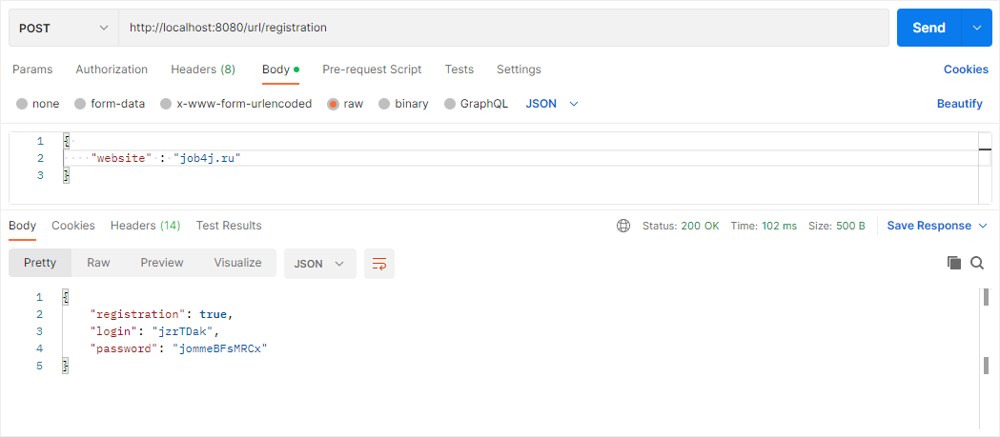
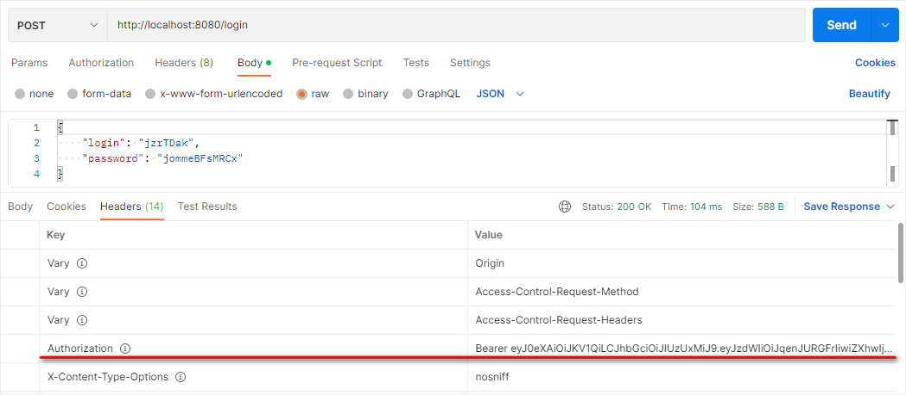
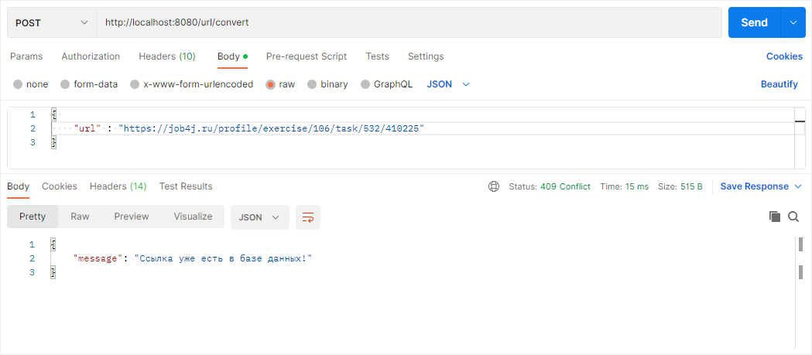
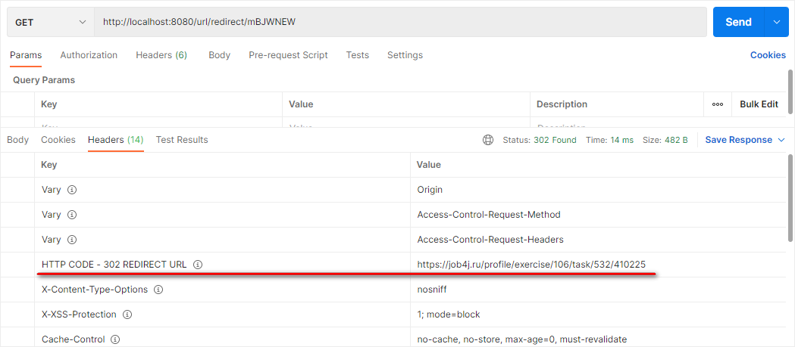

# Сервис - UrlShortCut

## Общее описание:

Генерация коротких ссылок для зарегистрированных сайтов. 

***

## Реализовано:
* Регистрация сайта.
* Авторизация.
* Регистрация URL.
* Переадресация. Выполняется без авторизации.
* Статистика.

***

## Технологии:

***

## Запуск проекта:
* создать базу данных `url_shortcut`
* `maven install`
* `java -jar target/job4j_url_shortcut-0.0.1-SNAPSHOT.jar`

***

## Структура проекта:

### Регистрация сайта.
Сайту выдаётся логин и пароль. Отправляем POST запрос с телом JSON объекта. Флаг registration указывает, что регистрация выполнена или нет, то есть сайт уже есть в системе.

### Авторизация
Авторизация через JWT, пользователь отправляет POST запрос логина и раннее полученного пароля. В блоке HEAD в ключе Authorization генерируется уникальное значение.

### Регистрация URL.
Отправляется POST запрос, генерируется короткая ссылка.

В блок HEAD указывается ранее полученный идентификатор с ключом Authorization.

Если ссылка уже была зарегистрирована, то выйдет уведомление.

### Переадресация.
Выполняется GET запрос без авторизации с указанием короткой ссылки. Происходит переадресация на полную ссылку.

При запросе счётчик обращений увеличивается на единицу.

### Статистика.
Статистика всех адресов и количество вызовов этого адреса. Необходима авторизация.

